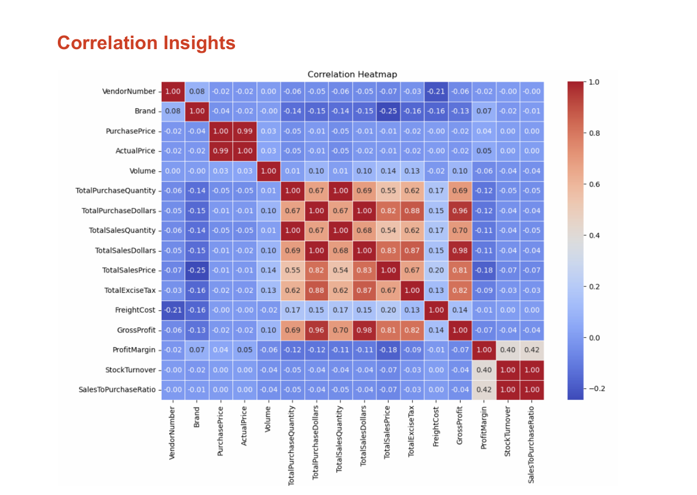
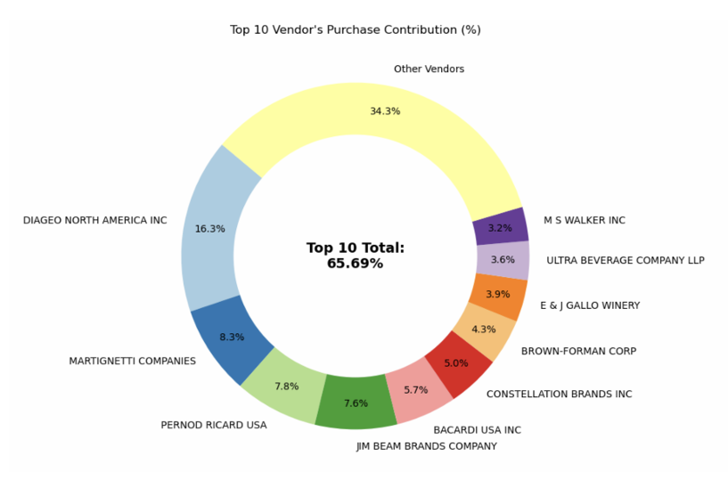

# 🏪 Vendor Performance Analytics — End-to-End Dashboard Project

This project is a complete procurement analytics pipeline developed to identify high-performing vendors, optimize purchasing patterns, reduce inventory risk, and enhance profitability in a retail business scenario.

> **Goal**: Use data to drive strategic procurement decisions by analyzing vendor behavior, cost efficiency, and inventory movement.

---

## 📘 Project Summary

This project was developed to address a practical and critical business problem: optimizing vendor selection, pricing strategies, and inventory management in a retail environment. Many businesses suffer losses due to poor visibility into vendor performance, inefficient procurement, and unsold stock tied up in warehouses.

The project uses a structured, real-world analytics approach to uncover:
- Underperforming brands that need promotional or pricing adjustments
- The cost-saving potential of bulk purchases
- Inventory inefficiencies caused by slow-moving stock
- Profitability differences between high and low-performing vendors
  
This project solves those problems by:
- Ranking vendors based on multi-dimensional metrics: sales volume, gross profit, purchase cost, and turnover
- Identifying slow-moving stock tied up in warehouses
- Evaluating cost advantages from bulk deals using statistical evidence
- Validating assumptions about vendor performance using hypothesis testing

To tackle this, I used a wide range of data analytics tools and techniques:

| Area                        | Tools / Skills Demonstrated |
|-----------------------------|-----------------------------|
| **Data Collection**         | Microsoft **Excel (.xlsx, .csv)** files from simulated vendor data |
| **Database Management**     | **SQLite** and **SQLAlchemy** to create and manage relational tables |
| **Data Analysis**           | **Python**, **Pandas**, **Matplotlib**, **Seaborn** for EDA |
| **Statistical Validation**  | **SciPy (T-Test)** and correlation analysis to test business assumptions |
| **Dashboarding**            | **Power BI** to create an executive-friendly dashboard for insights |
| **Reporting**               | Professional PDF report summarizing all business findings |
| **Notebook Interface**      | **Jupyter Notebook** to document the step-by-step process |

Each stage of the project reflects industry-aligned best practices:
- ✅ Understanding the business context and framing the right questions
- ✅ Setting up a SQL database for clean, structured analysis
- ✅ Exploring, filtering, and visualizing the data using Python
- ✅ Validating key hypotheses statistically (e.g. bulk purchasing reduces cost, high-margin vendors underperform in volume)
- ✅ Communicating results through a Power BI dashboard and written report

The project not only improves decision-making for vendor partnerships and inventory control, but also demonstrates my ability to independently deliver insights across the full data analysis lifecycle — from messy Excel files to executive dashboards.

---

### 📊PowerBI Dashboard 

## 🧩 Key Features

- 📌 **Multi-table data ingestion**: Consolidated sales, purchase, inventory, and vendor datasets
- 📌 **Automated SQLite schema creation**: Data cleaned and loaded into queryable SQL tables
- 📌 **Outlier detection**: Highlighted freight and unit cost anomalies
- 📌 **Inventory turnover analysis**: Identified $2.7M of unsold inventory
- 📌 **Bulk pricing evaluation**: Proved up to 72% savings when vendors buy in larger quantities
- 📌 **Hypothesis testing**: Rejected null hypothesis regarding vendor margin equivalence
- 📌 **Dynamic Power BI dashboard**: Slicers and DAX measures to filter by vendor, brand, or region

---
### 🧾 Inventory Turnover Analysis

---
### 📈 Correlation Matrix

---
### 🏷️ Vendor Contribution by Sales & Purchase

